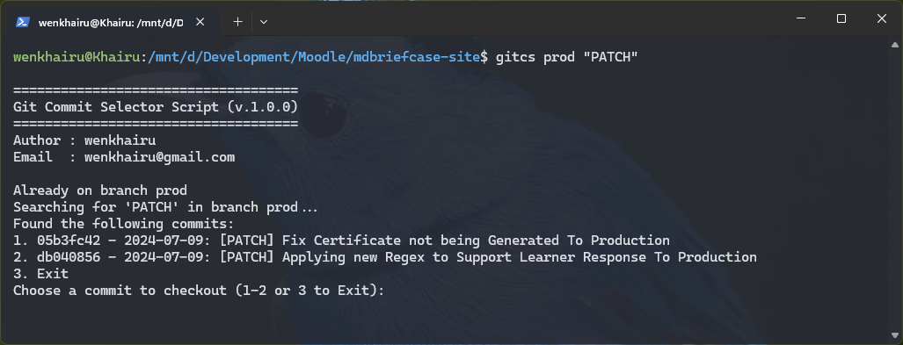
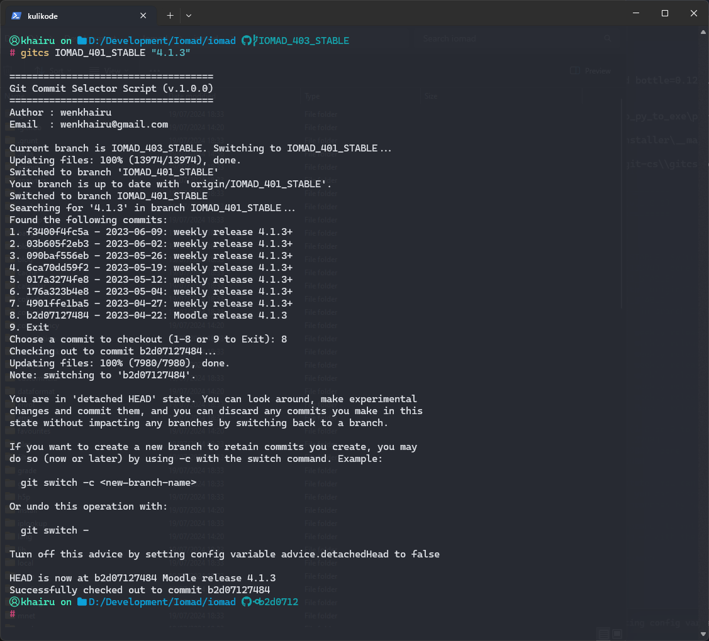
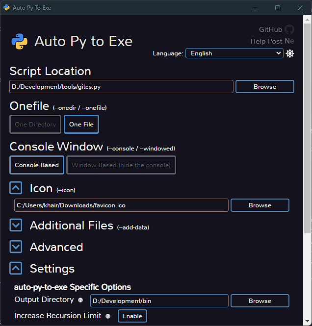

# Git Commit Selector 



## Why
In large software projects, managing releases and finding specific release commits can be challenging. Me specially often need to switch between different release versions for debugging, testing, or deployment purposes. Manually searching through Git logs to find the exact commit for a specific release can be time-consuming and error-prone.  

This script was created to solve these problems by:  

1. Automating the process of finding release commits.  
2. Providing an interactive way to select and checkout to specific release commits.  
3. Streamlining the workflow for developers working with multiple releases.  

The Git Commit Selector is a bash script designed to simplify the process of finding and checking out to specific release commits in a Git repository. It addresses common challenges faced by developers when working with multiple releases.

### Key Features:  

1. **Automated Release Search**: Quickly finds all commits related to a specific release version.  
2. **Interactive Selection**: Presents a list of matching commits and allows the user to select one interactively.  
3. **Automatic Checkout**: Checks out to the selected commit, saving time and reducing errors.  
4. **Branch Switching**: Automatically switches to the specified branch before searching for commits.  
5. **Error Handling**: Robust error checking ensures the script fails gracefully with informative messages.  
6. **User-Friendly Interface**: Clear prompts and a simple banner make the script easy to use.  

### How It Works:  

1. The script first checks if it's run in a Git repository and if the correct number of arguments is provided.  
2. It then switches to the specified branch if necessary.  
3. Using Git log commands, it searches for commits containing the specified release version.  
4. The filtered commits are presented to the user in a numbered list.  
5. The user can then select a commit number or choose to exit.  
6. If a commit is selected, the script automatically checks out to that commit.  

This tool is particularly useful for teams working on projects with numerous releases, helping to maintain efficiency and reduce the likelihood of errors when navigating between different versions of the codebase.  

# Installation on WSL / Linux Based System

### Prerequisites:  

- Bash shell  
- Git installed and configured  

### Easy Install

Simply download the Bash version of this and execute the following command.
```sh
sudo chmod +x gitcs
sudo mv gitcs /usr/local/bin/gitcs
```

### Installation Using the Installer Script:  

#### Download the Installer Script
Download the `install.sh` script from the repository or directly create it using any text editor.  

#### Run the Installer Script
Open your terminal and navigate to the directory where you saved the `install.sh` script. Run the script:  
```sh  
chmod +x install.sh  
./install.sh  
```

The script will:
- Clone the repository.
- Make the main script executable.
- Optionally add the script directory to your PATH.

#### Verify Installation
After installation, you can use the script directly by calling:
```sh
gitcs
#or
gitcs <branch_name> <release_version>
```
## Installation on Windows System
Go to the Releases page of this repository and download the latest Windows executable `gitcs.exe`. then Move the downloaded gitcs.exe to a directory of your choice, e.g., `C:\Tools\gitcs` and Add the directory containing `gitcs.exe` to your system's PATH environment variable:

- Right-click on 'This PC' or 'Computer' on your desktop or in File Explorer.
- Click on 'Properties'.
- Click on 'Advanced system settings'.
- Click on the 'Environment Variables' button.
- In the 'System variables' section, find the Path variable and click 'Edit'.
- Add the path to the directory where you placed gitcs.exe (e.g., `C:\Tools\gitcs`).
- Click 'OK' to close all dialogs.

Open Command Prompt and type:
```sh
gitcs
#or
gitcs <branch_name> <release_version>
```

## How To Use
Execute the script or executable with two parameters: `branch_name` and `release_version`. While the `release_version` is intended for release identifiers, you can also input any other value as needed. for example, In this scenario, I aim to locate a specific version of IOMAD LMS. I will be searching for a commit that includes the keyword `4.1.3` in the `IOMAD_401_STABLE` branch. Once I identify the desired commit, this script will automatically check out to that selected commit.
```sh
gitcs IOMAD_401_STABLE "4.1.3"
```
and here is the result



# Compile a Bash script into standalone executables for both Linux and Windows

I'm not certain if this is necessary, but in case someone needs it, here are the steps. Below are instructions on how to compile a Python script into standalone executables for both Linux and Windows using `PyInstaller` and `auto-py-to-exe`

## Prerequisites

1. **Python** Ensure that Python is installed on your system. Python 3.x is recommended.
Install Python from python.org if not already installed.
2. **PyInstaller**: This tool converts Python applications into standalone executables for Linux.
    ```sh
    pip install pyinstaller  
    ```
3. **auto-py-to-exe**: This tool provides a graphical interface for converting Python scripts to standalone Windows executables.
    ```sh
    pip install auto-py-to-exe  
    ```

## Compilation Instructions
### Compiling for Linux Using PyInstaller

Navigate to the Script Directory: Open your terminal and navigate to the directory where your `gitcs.py` script is located.
```sh
pyinstaller --clean --onefile gitcs.py
```
This will generate an executable named gitcs in the `dist` directory within your script's directory.Next, you simply need to place the executable in the system path by using the following command.
```sh
sudo mv gitcs /usr/local/bin/gitcs
```

### Compiling for Windows Using auto-py-to-exe
Run the following command to open the graphical interface for `auto-py-to-exe`.
```cmd
auto-py-to-exe
```

**Configure auto-py-to-exe**
- Script Location: Select the git_release_finder.py script.
- One File: Check the option to bundle everything into one executable.
- Output Directory: Choose the directory where you want the executable to be saved.
- Console Window/No Console Window: Choose whether you want a console window to appear when running the executable.
- Additional Files: Add any additional files or folders your script requires.

Click the `"Convert .py to .exe"` button. This will convert your Python script into a Windows executable and place it in the specified output directory. The next step is to configure your ENV path.


